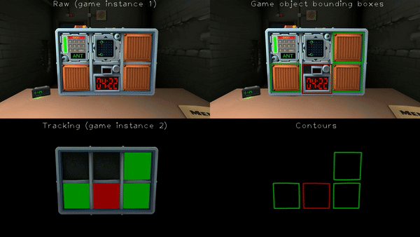

# [In progress] Keep talking And Nobody Explodes (Ktane) tracking module for image processing with deep learning

Tracking of the bomb modules in Keep Talking and Nobody Explodes (ktane) to create a dataset for training a neural network in modules identification

## Demo video

Please wait for the video to load

FORMAT: A1

# Movies API

This is an API Blueprint example describing a movies API.

# Group Movies

Resources related to movies in the API.

## Movie collection [/movies]

### List all Movies [GET]

List movies in reverse order of publication.

+ Response 200 (application/json)